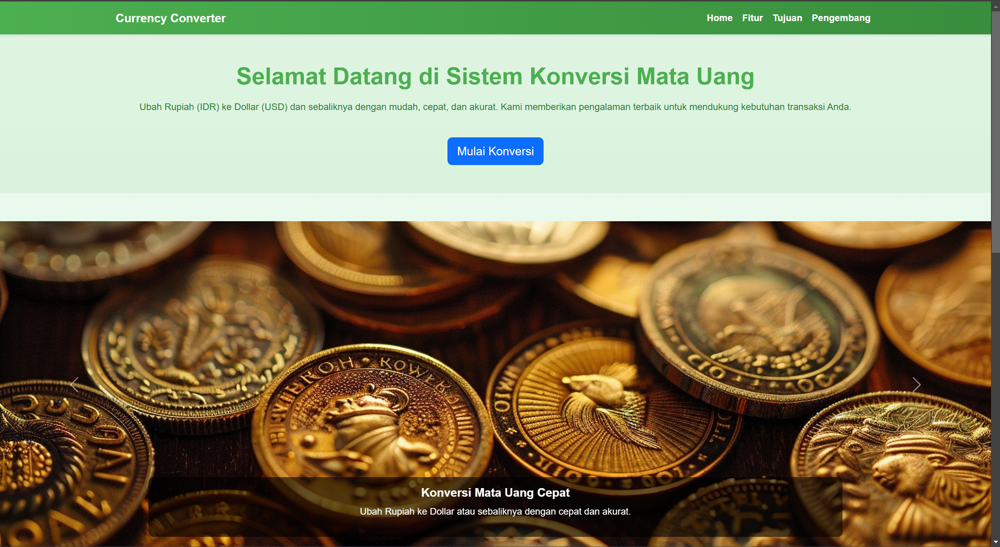
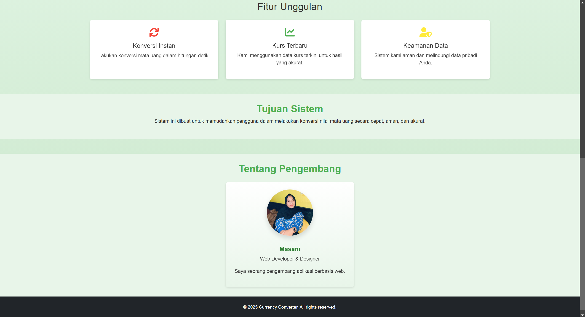
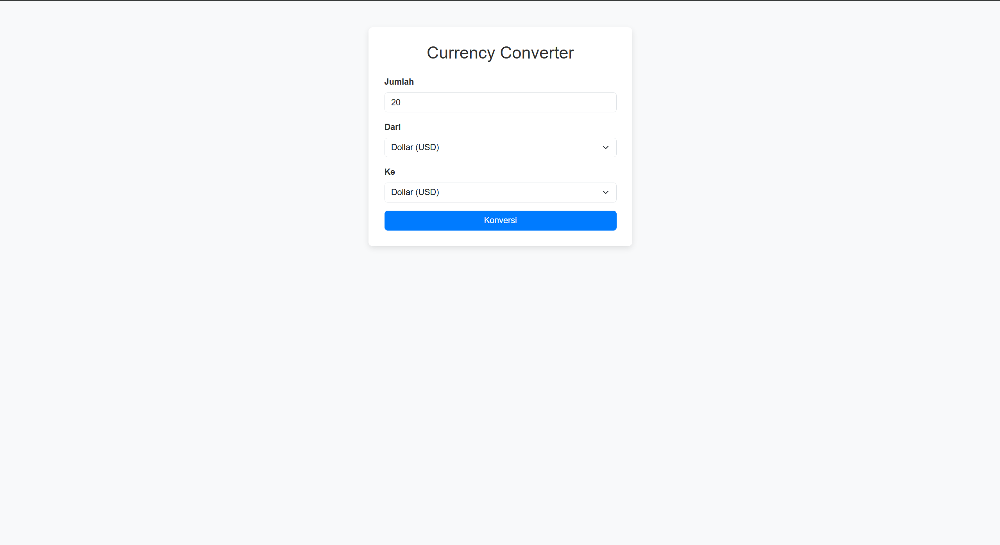
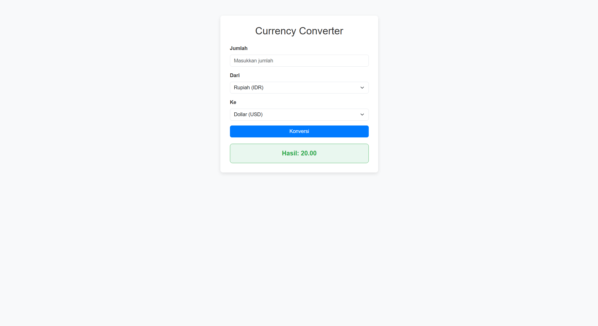

# Sistem Konversi Mata Uang - PHP

Sistem Konversi Mata Uang berbasis **PHP** adalah aplikasi berbasis web yang memungkinkan pengguna untuk melakukan konversi antar mata uang dengan mudah. Sistem ini mengakses **nilai tukar mata uang terkini** melalui API eksternal dan menghitung konversi berdasarkan kurs yang berlaku. Aplikasi ini cocok untuk pengguna yang memerlukan konversi mata uang internasional, perencanaan keuangan, atau tujuan lainnya.

## Fitur Utama

- **Konversi Antar Mata Uang**: Pengguna dapat memilih mata uang asal dan mata uang tujuan untuk melakukan konversi secara cepat.
- **API Nilai Tukar Mata Uang**: Menggunakan API untuk mengambil nilai tukar mata uang terkini dan melakukan perhitungan konversi secara otomatis.
- **Penyajian Nilai Tukar**: Menampilkan hasil konversi dalam format yang mudah dipahami.
- **Antarmuka Pengguna yang Sederhana**: Halaman antarmuka yang user-friendly dan mudah digunakan.

## Teknologi yang Digunakan

- **Frontend**: HTML, CSS, Bootstrap 5
- **Backend**: PHP
- **API**: API nilai tukar mata uang (misalnya, API dari [ExchangeRate-API](https://www.exchangerate-api.com/) atau [CurrencyLayer](https://currencylayer.com/))
- **Database**: Tidak diperlukan, karena data diambil langsung dari API.

## Tampilan Sistem

